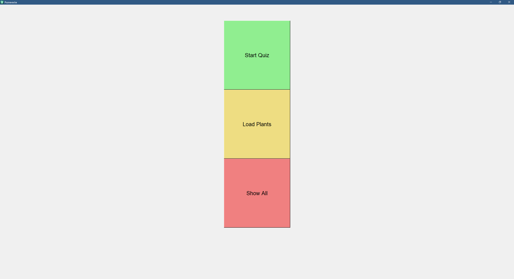

# Poznavacka

Application for testing your skills in plant recognizing.
You can add your own plants, delete them, and test your skills.
Application use basic data storing, so your score and plants will be saved during individual trainings.

There are few demo plants, however, it is expected to add own pictures.
Pictures need to be named in this format:
    Lonicera Japonica (1)
    Lonicera Japonica (2)
    .
    .
    .

File name needs to contain parentheses with number.

